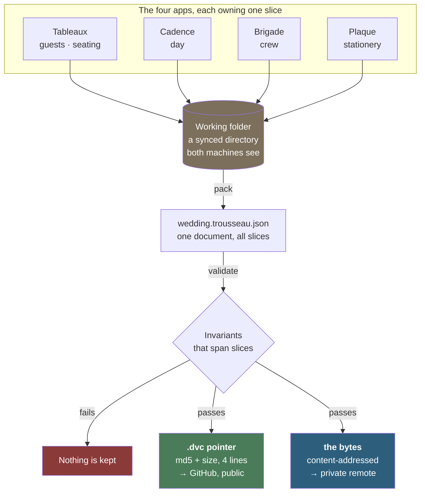

# Trousseau

**One wedding, four apps, and no arguments about which copy is right.**

A trousseau is the collection carried into a marriage. A `.trousseau.json` is
the same idea: one file holding the whole wedding, which any of the tools can
read and none of them can damage.

This repo is where that file lives — the data hub for
[Tableaux](https://github.com/JFrusher/Tableaux) (seating),
[Cadence](https://github.com/JFrusher/cadence) (timeline),
[Brigade](https://github.com/JFrusher/Brigade) (crew) and
[Plaque](https://github.com/JFrusher/Plaque) (stationery). It holds the schema
they agree on, the tool that collects their work into one document, the checks
that run before anything is kept, and the version history of every state the
wedding has been in.

Built for our own wedding, which is the only reason the constraints are honest:
real guest names and dietary requirements, four apps that must not overwrite
each other, two laptops, and a date that does not move.


---

## The problem

Four apps, each owning part of one wedding. Seating lives in one, the running
order in another, the crew in a third, the place cards in a fourth. Every one of
them can export a file. None of them agrees with the others for long.

You find out at the worst possible moment: the place cards say table 6 and the
seating plan says table 8, or two apps quietly disagree about what day you are
getting married. That last one is not hypothetical — it happened here, and the
system in this repo is what caught it.

Git is the obvious answer and the wrong one. It keeps every version of every
file forever, which is right for code and wrong for a 100 KB JSON blob rewritten
whole every time a guest moves. And these repos are public, while the data has
real people's email addresses in it.

## The shape of the answer

Git carries **pointers**. A private remote carries **bytes**.



The pointer is a four-line text file, so Git versions it like any other. That
means Git's history *is* the data's history — a tag pins code, schema and the
exact bytes together, and checking out that tag six months later brings the
matching data back. No second version-control system was built; Git's was
borrowed.

A terminal-friendly version of this diagram is in
[docs/DATA.md](docs/DATA.md).

## One owner per slice

The rule the whole design rests on:

> An app rewrites **only its own slice** and copies every other key
> byte-for-byte — including keys belonging to apps that do not exist yet.

| Slice | Owner |
| --- | --- |
| `event` | the launcher |
| `guests`, `seating` | Tableaux |
| `day` | Cadence |
| `crew` | Brigade |
| `stationery` | Plaque |

Owners publish resolved output; nobody recomputes. Tableaux publishes who sits
where and Plaque prints the table number on the card. Cadence publishes the
clock times it worked out and Brigade reads them, never running a scheduler.

`mergeSlice` enforces this, and takes *raw stored data* rather than a parsed
document on purpose: a wrong schema should at worst refuse a read, never destroy
a write. Unknown keys survive at every level — which is how a fifth app joins
without anyone releasing a new version of anything.

## Checks that span slices

The zod schema validates the envelope and stops there. Slice interiors belong to
the owning app, deliberately: encoding what a guest is here would mean a Tableaux
feature could not ship without a release of this package.

So the interesting checks are the ones **no single app can perform**, because an
app only ever sees its own slice:

| | |
| --- | --- |
| error | two slices claiming different wedding dates |
| error | one seat holding two people |
| error | a table holding a guest who does not exist |
| error | the same guest seated twice at one table |
| error | a table over its own capacity |
| error | a guest and their table disagreeing about where they sit |
| error | a day block in a lane that does not exist |
| warning | confirmed guests with no table, or no dietary answer |

Errors exit 1 and block the commit. They run as a pre-commit hook, so nothing
inconsistent can be recorded in the first place.

Two more refusals live in the collector. It rebuilds the bundle from only the
files it is handed, so omitting one silently deleted that slice — packing with
just the seating file once dropped a thirteen-block timeline and reported
success. It now compares against what it is about to overwrite and refuses.
It also prints every source file's date and flags any that has fallen days
behind, because a browser app's file is only as fresh as the last write to it.

## The contract, as code

The schema is a TypeScript package in [`src/`](src), built with zod 4 and
covered by 83 tests.

```ts
import { emptyTrousseau, mergeSlice, migrate, parse, serialise } from "@jfrusher/trousseau";

// Read stored data. Never throws away what it does not understand.
const doc = migrate(rawFromStorage);

// Publish your slice. Every other key is copied untouched.
const next = mergeSlice(rawFromStorage, "day", myResolvedDay);
await saveRaw(next); // your storage, raw — mergeSlice never parses

// The portable file, from a parsed document.
const back = parse(serialise(migrate(next)));
```

**The apps do not import this yet.** The package is built and tested, but not
published, and the collector reads each app's native export instead. Having the
apps consume the contract directly is the next step, not a finished one.

## Using it

Everything operational — first-time setup, the daily loop, moving between
machines, milestones, and what to do when two machines disagree — is in
**[docs/DATA.md](docs/DATA.md)**.

The short version, once configured:

```sh
npm run sync
```

Collect, check, upload the bytes, commit the pointer, push — in that order, each
one a gate. `npm run sync -- --dry-run` stops before anything leaves the machine.

## Where this is

**Working:** the schema and its 83 tests; the collector, with its staleness and
slice-loss guards; the cross-slice validator; DVC tracking to a private remote;
versioned Git hooks that validate before a commit and send bytes before
pointers; a single `sync` command.

**Not yet:** the apps do not import the package — the collector reads their
native files. Cadence, Brigade and Plaque need a file linked by hand once, from
a button, before their work reaches the working folder automatically; that
button is Chromium-only. Nothing writes a `stationery` slice yet.

## A note on what is not in this repo

Every repo here is public, and the data has real guests in it. No name, email
address or dietary requirement is committed anywhere — Git holds only md5
hashes and byte counts. Machine-specific paths (the remote URL, the working
folder) live in files Git ignores, because they name one person's computer.

If you fork this, keep that arrangement. It is the only reason the rest of it
can be public.

## Licence

[MIT](LICENSE) — free to clone, adapt, and use for your own wedding.
