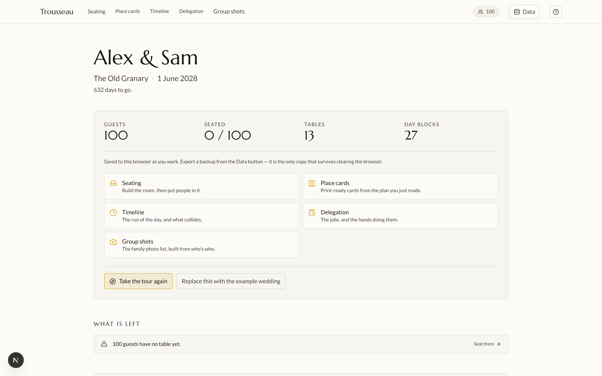
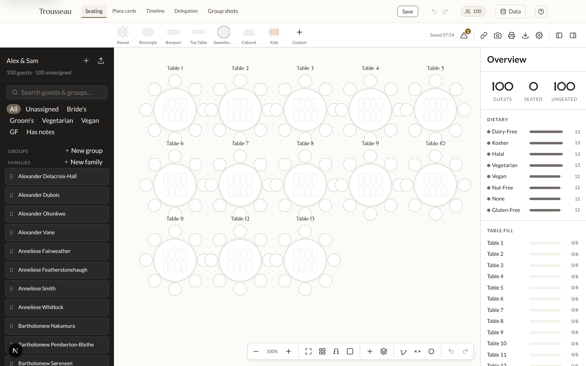
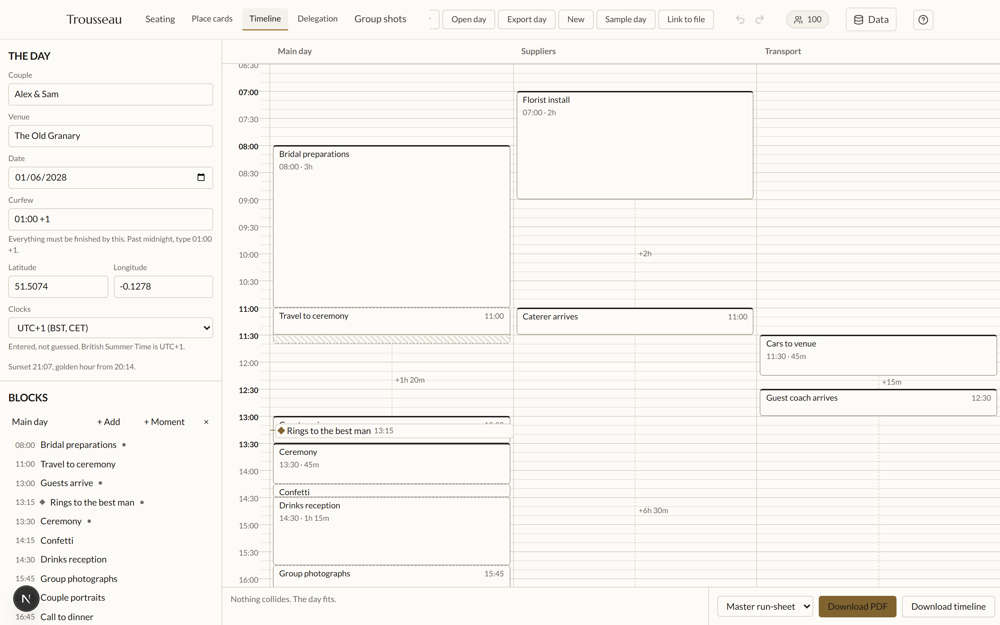
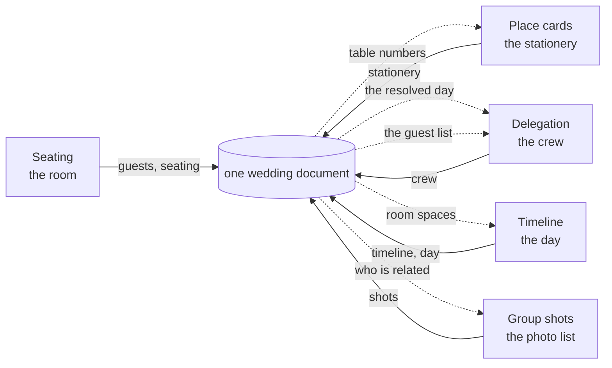

# Trousseau

**Plan a whole wedding in one place, without five tools disagreeing about it.**

[**Open Trousseau →**](https://trousseau-suite.vercel.app) &nbsp;·&nbsp;
[Run your own copy](docs/SELF-HOSTING.md) &nbsp;·&nbsp;
[How it works](#how-it-works)

Free, open source, and free forever. No paid tier, no upsell, no trial.



---

## What it is

Five planning tools that share one document, so a change in any of them shows
up correctly in the others.

Seat someone in the room and the place cards already know their table. Move the
ceremony by ten minutes and every job hanging off it moves with it. Nothing is
re-typed, and nothing quietly disagrees.

| Tool | What it does |
| --- | --- |
| 🪑 **Seating** | Draw the room to scale, then put people in it |
| 💌 **Place cards** | Print-ready cards and table signs, with the table numbers already filled in |
| 🕒 **Timeline** | The running order — what happens when, and what collides |
| 📋 **Delegation** | The jobs, and the people doing them |
| 📷 **Group shots** | The family photo list, built from who's related to whom |

> [!NOTE]
> You do not need an account. Open the app and start — everything is saved in
> your browser. An account only adds syncing between devices and sharing with
> your partner.

---

## Getting started

### The quickest possible start

1. Open **[trousseau-suite.vercel.app](https://trousseau-suite.vercel.app)**.
2. Press **Data**, and put in your names, your venue and the date.
3. Import your guest list as a CSV — exports from Joy, Zola, The Knot or your
   own spreadsheet all work, and the column mapper will ask about anything it
   cannot guess.
4. Open **Seating** and drag a few tables onto the canvas.

That is enough to be useful. Everything else builds on it.

### Planning together

Weddings have two people in them, so an account has room for two.

1. Sign in with your email. There is no password — you get a link, you click
   it, you are in.
2. From **Your account**, invite your partner by email.
3. You are both now editing the same wedding, from your own devices.

If you both change the same thing at once, Trousseau says so and asks which
version to keep. It never silently picks one.

---

## A short guide

### 1. Start with the room

Open **Seating**. Drag table shapes from the toolbar onto the canvas, then drag
guests from the left-hand list onto seats.

The room is drawn to scale in real units, so a table that does not fit on the
canvas is a table that will not fit on the day.

The panel on the right keeps a running count of who is seated, and breaks the
guest list down by dietary requirement as you go.



### 2. Plan the day

Open **Timeline**. Add blocks in lanes — the main day, suppliers, transport,
whatever your day actually needs. Give a block a duration, then either pin it
to a time or let it follow whatever comes before it.

That distinction is the useful part. Pin the ceremony, let everything after it
follow, and moving the ceremony moves the rest of the day with it.

Anything that collides, or runs past your curfew, is flagged while you work.

The Location field offers the names of spaces you drew in the room, so
"Orangery" on the run sheet is the same Orangery on the floor plan. It still
takes free text — a church nobody is going to draw a floor plan of is a real
place.



### 3. Hand out the jobs

Open **Delegation**. Every block of the day is a row you can hang jobs off. Add
teams and people, then click a job and click who is doing it.

Someone already on your guest list is added by picking them, not by typing
their name again — so their name is only ever corrected in one place.

### 4. Print the cards

Open **Place cards**. Press **Use the room** and the guest list arrives with
table numbers already attached. Design the card by binding `{{First Name}}`,
`{{Table}}` and the rest onto your artwork.

```text
┌─────────────────────────────┐
│                             │
│        Charis Smith         │   85 × 55mm, 9 per A4 sheet
│                             │
│           Table 1           │
│                             │
└─────────────────────────────┘
```

> [!TIP]
> Print two test cards on plain paper and hold them against your real card
> stock before committing. The export refuses to print a card with a missing
> font or a hole where a monogram should be — cheaper than finding out after
> the good stock has gone through.

### 5. Take the pack

The front page has one button that produces the floor plan, the run sheet, the
job list and the group shot list as a single PDF, printed from the wedding as
it currently stands.

Place cards are deliberately not in it. They go on card stock, and an A4 binder
and a tray of card are two different trips to the printer.

### 6. Send guests their table

A share link shows one guest their own seat and nothing else.

The decryption key travels in the URL fragment, which browsers never send to a
server. The link works without anyone — including whoever is hosting the
app — holding a readable copy of your guest list.

---

## Your data

**Everything works with no account.** Open the app and it saves to your
browser. Nothing leaves the device.

**With an account**, your wedding syncs so you and your partner can both work
on it. It is stored encrypted at rest, and database-level rules mean no other
account can read it — not even by accident.

**You can always take it out.** From **Your account**, *Download my wedding*
gives you the whole thing as one `.trousseau.json` file. That is the same
format the app itself uses, so it opens straight back into Trousseau — hosted
here, or on a copy you run yourself.

**Deleting your account deletes your data.** If your partner is still on the
wedding, the wedding stays with them; if you were the last one, it goes.

> [!IMPORTANT]
> There is no admin panel and no support login. Nobody running a Trousseau
> instance — including the hosted one — has a way to read your wedding. That is
> a deliberate design choice, and the reason support is "send us a screenshot"
> rather than "let me look at your account".

---

## Run it yourself

The hosted instance is the easy path, but it is not the only one. Trousseau is
AGPL software and self-hosting is genuinely supported, not theoretically
possible.

```sh
git clone https://github.com/JFrusher/Trousseau.git
cd Trousseau

npm install
npm run build      # builds the shared contract package — do not skip

cd suite
npm install
npm run dev
```

That gives you the whole suite locally, with no backend and no account.

Adding accounts and sync means a Supabase project and seven migrations.
**[docs/SELF-HOSTING.md](docs/SELF-HOSTING.md)** covers all of it — every
environment variable, the migration order, and a section on how to check your
instance actually works rather than merely starting.

---

## How it works

### One document, one owner per slice

The rule everything rests on:

> A tool rewrites **only its own slice**, and copies every other key
> byte-for-byte — including keys belonging to tools that do not exist yet.



Solid lines are what a tool writes. Dotted lines are what it reads from the
others — and those are the whole point.

`timeline` holds the source of the day: which block is anchored, which follows
after a gap. `day` holds what those work out to as actual clock times.
Delegation reads the second and never runs a scheduler of its own, which is why
a ceremony moving by ten minutes moves every job hanging off it without
anything recalculating.

The merge is enforced in one place, and deliberately operates on *raw stored
data* rather than a parsed document: a bug in a schema should at worst refuse a
read, never destroy a write. Unknown keys survive at every level, which is how
a sixth tool could be added without releasing a new version of the other five.

### Checks no single tool can run

Each tool only sees its own slice, so the interesting problems live between
them.

| | |
| --- | --- |
| 🔴 error | two parts of the wedding claiming different dates |
| 🔴 error | one seat holding two people |
| 🔴 error | a table holding a guest who does not exist |
| 🔴 error | a table over its own capacity |
| 🔴 error | a guest and their table disagreeing about where they sit |
| 🔴 error | a day block in a lane that does not exist |
| 🟡 warning | confirmed guests with no table, or no dietary answer |

The front page runs its own version of this and shows what is left: cards
printed from a stale file rather than the live room, a dietary requirement
recorded for someone whose card has nowhere to show it, a block happening
somewhere that is not on the floor plan.

Only the gaps *between* tools. Anything one tool can see for itself, it reports
itself.

### What is in here

The first four tools were standalone applications before this and keep their
own stores and stylesheets; only the file deciding where their work is saved
was redirected into the shared document. Group shots was the first built here
rather than adopted, so it has none of that and reads the shared document
directly.

```text
suite/           the web application
  apps/          Seating, Place cards, Timeline, Delegation
  lib/           the shared document, sync, accounts, Group shots, design tokens
  components/    the shell around the tools, and Group shots' panels
  app/           routes, API, account and guest-link pages
src/             the data contract, published as @jfrusher/trousseau
supabase/        database migrations
docs/            self-hosting, data notes, specs and plans
```

---

## Where this came from

Trousseau was built for one specific wedding — which is the only reason its
constraints were ever honest. Real guest names and dietary requirements, tools
that genuinely must not overwrite each other, and a date that does not move.

Two apps once disagreed about what day the wedding was. The cross-slice checks
above exist because of that, not because they seemed like a good idea.

That wedding has happened. Trousseau is now being built as something other
couples can use, which is why it grew accounts, real cloud storage and a
self-hosting story. The design did not change, because the design was the part
that was working.

Where it is going next is in
**[docs/PRODUCT-ROADMAP.md](docs/PRODUCT-ROADMAP.md)** — a living document
covering what is built, what is decided, and what is still open.

---

## Contributing

Issues and pull requests are welcome.

- **Found a bug?** Open an issue describing what you did and what happened.
  **Never paste your guest list** — a screenshot with names blurred, or a
  description, is plenty.
- **Want to change something?** The roadmap explains what is planned and why.
  Design decisions are written down in `docs/superpowers/specs/` rather than
  living in anyone's head, so it should be possible to tell whether an idea
  fits before writing any code.
- **Running the tests:** `npx vitest run` from `suite/` covers all five tools
  and the shell; `npm test` at the root covers the contract package.

---

## Licence

Two licences, because this repository holds two different things.

The **application** — everything in `suite/` — is
**[AGPL-3.0-or-later](LICENSE-AGPL)**. Trousseau is free and always will be,
and the AGPL is what keeps it that way: run it, change it, host it for friends.
Host a modified version for other people and they are entitled to your source
too.

The **contract package**, `@jfrusher/trousseau`, is **[MIT](LICENSE-MIT)**. It
is the schemas and the file format, kept permissive on purpose so that a tool
nobody has written yet can depend on it.

Fonts are under the SIL Open Font Licence; see the `OFL-*.txt` files beside
them.

There is no paid tier and there never will be. That is the reason this exists.
