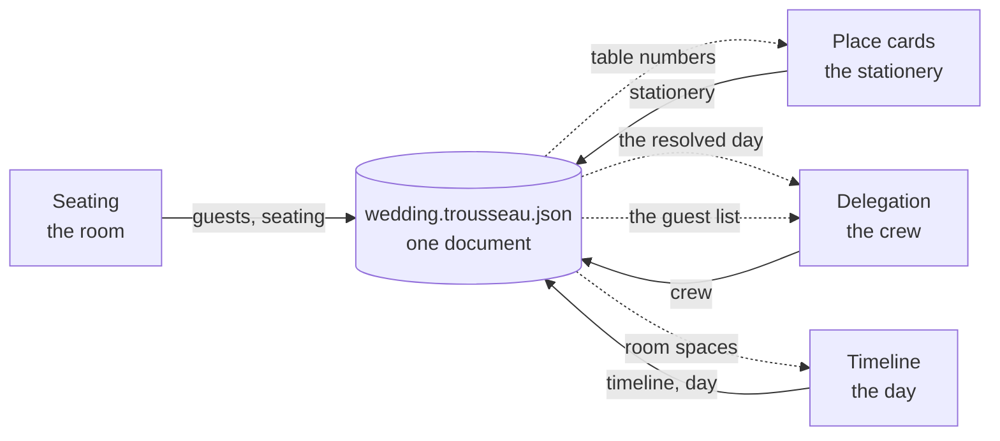
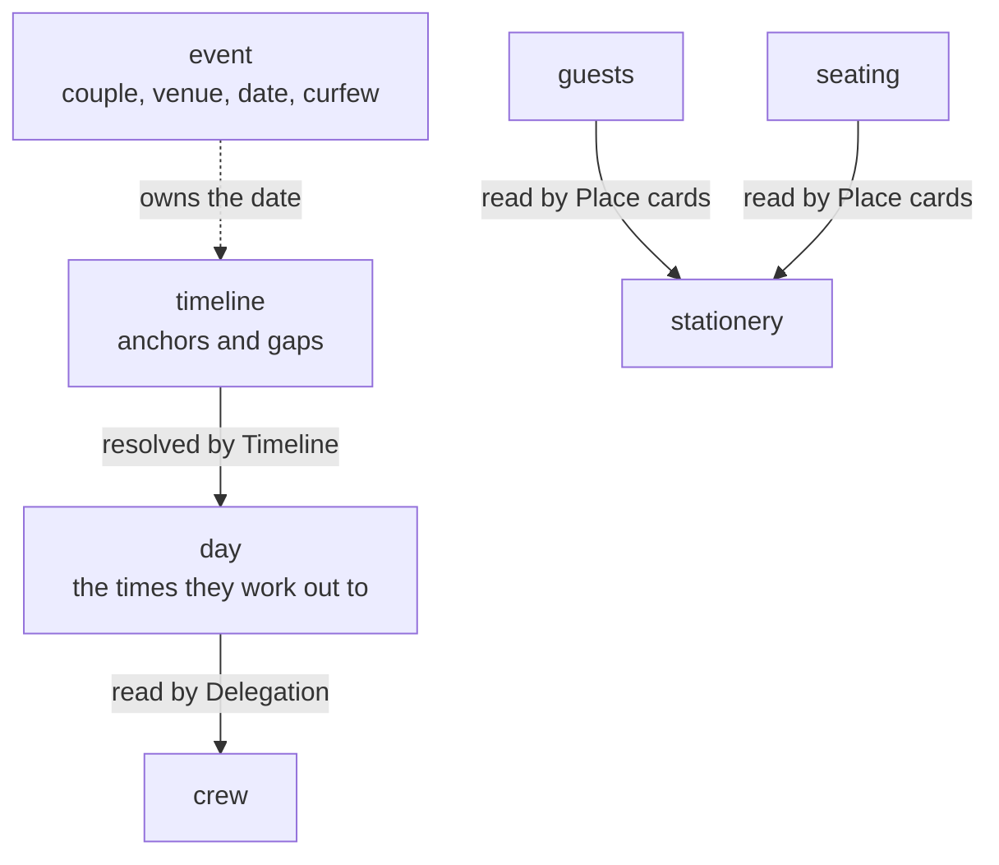

# Trousseau

**One wedding, four tools, and no arguments about which copy is right.**

A trousseau is the collection carried into a marriage. A `.trousseau.json` is the
same idea: one file holding the whole wedding, which any of the tools can read
and none of them can damage.

This repo holds both halves of that. `suite/` is the web application — four
planning tools sharing one document, running on Vercel. The rest is the data:
the schema they agree on, the checks that run before anything is kept, and the
version history of every state the wedding has been in.

Built for our own wedding, which is the only reason the constraints are honest:
real guest names and dietary requirements, four tools that must not overwrite
each other, two laptops, and a date that does not move.

---

## The problem

Four apps, each owning part of one wedding. Seating in one, the running order in
another, the crew in a third, the place cards in a fourth. Every one of them can
export a file. None of them agrees with the others for long.

You find out at the worst possible moment: the place cards say table 6 and the
seating plan says table 8, or two apps quietly disagree about what day you are
getting married. That last one is not hypothetical — it happened here, and the
checks in this repo are what caught it.

So the four became one application over one document.



Solid lines are what a tool writes. Dotted lines are what it reads from the
others — and those are the point. Seat someone and the place cards already know
their table. Move a block of the day and every job hanging off it moves too.

---

## The four tools

| Tool | Does | Writes | Reads from the others |
| --- | --- | --- | --- |
| **Seating** | Builds the room to scale and puts people in it | `guests`, `seating` | — |
| **Place cards** | Print-ready cards and table signs | `stationery` | the guest list and their tables |
| **Timeline** | The running order, and what collides | `timeline`, `day` | the room's named spaces |
| **Delegation** | The jobs, and the hands doing them | `crew` | the resolved day, the guest list |

Each was a standalone application before this, and each keeps its own store, its
own undo history and its own stylesheets. Only the file that decides where its
work is saved was redirected into the shared document.

---

## A short guide

### 1. Start with the room

Open **Seating**. Import a guest list as CSV — the column mapper handles exports
from Joy, Zola, or a spreadsheet you have been keeping yourself. Drag table
shapes from the toolbar onto the canvas, then drag guests onto seats.

The room is drawn to scale in real units, so a table that does not fit is a
table that will not fit on the day.

### 2. Plan the day

Open **Timeline**. Add blocks in lanes — the main day, suppliers, transport,
whatever the day needs. Give a block a duration and either pin it to a time or
let it follow whatever comes before it.

The Location field offers the names of spaces you drew in the room, so
"Orangery" on the run sheet is the same Orangery on the floor plan. It still
takes free text; a church nobody is going to draw a plan of is a real place.

Anything that collides, or runs past your curfew, is flagged as you work.

### 3. Hand out the jobs

Open **Delegation**. Every block of the day is a row you can hang jobs off.
Add teams and people, then click a job and click who is doing it.

Someone already on the guest list is added by picking them, not by typing their
name again — their name is then read from the guest list, so it is only ever
corrected in one place.

### 4. Print the cards

Open **Place cards**. Press **Use the room** and the guest list arrives with the
table numbers already on it. Design the card by binding `{{First Name}}`,
`{{Table}}` and the rest to text on the artwork.

```
┌─────────────────────────────┐
│                             │
│        Charis Smith         │   85 × 55mm, 9 per A4 sheet
│                             │
│           Table 1           │
│                             │
└─────────────────────────────┘
```

Print two test cards on plain paper first and hold them against your real stock.
The export refuses to print a card with a missing font or a hole where a
monogram should be, which is cheaper than finding out after the card stock has
gone through.

### 5. Take the pack

The front page has one button that produces the floor plan, the run sheet and
the job list as a single PDF, printed from the wedding as it stands.

Place cards are deliberately not in it — they go on card stock, and an A4 binder
and a tray of card are two different trips to the printer.

### 6. Send guests their table

A share link shows a guest their own seat and nothing else. The key travels in
the URL fragment, which browsers never send to a server, so the link works
without anyone holding a decryptable copy of your guest list.

---

## One document, one owner per slice

The rule the whole design rests on:

> A tool rewrites **only its own slice** and copies every other key
> byte-for-byte — including keys belonging to tools that do not exist yet.



`timeline` holds the source — which block is anchored, which follows after a
gap. `day` holds what those work out to. Delegation reads the second and never
runs a scheduler of its own, which is why a ceremony moving by ten minutes moves
every job hanging off it without anybody recalculating anything.

`mergeSlice` enforces the rule, and takes *raw stored data* rather than a parsed
document on purpose: a wrong schema should at worst refuse a read, never destroy
a write. Unknown keys survive at every level, which is how a fifth tool could
join without a release of anything.

### Checks no single tool can run

A tool only ever sees its own slice, so the interesting checks are the ones that
span them. These run as a pre-commit hook; errors exit 1 and stop the commit.

| | |
| --- | --- |
| error | two slices claiming different wedding dates |
| error | one seat holding two people |
| error | a table holding a guest who does not exist |
| error | a table over its own capacity |
| error | a guest and their table disagreeing about where they sit |
| error | a day block in a lane that does not exist |
| warning | confirmed guests with no table, or no dietary answer |

The application has its own version of this on the front page: cards printed
from a file rather than the room, a dietary requirement recorded for someone
whose card has nowhere to show it, a block happening somewhere that is not on
the floor plan. Only the gaps between tools — anything one tool can already see
for itself, it reports itself.

---

## Running it

```sh
cd suite
npm install
npm run dev
```

Everything is local-first. There is no account, and nothing leaves the browser
unless you turn on sync.

```sh
npm test          # 1,233 tests
npm run build
```

### Deploying

Vercel, with **Root Directory** set to `suite`. Pushes to `main` deploy.

Sharing and sync are the only features that need a backend. Leave these unset
and the suite is exactly what it was — local-first, no account, nothing leaving
the device:

```sh
SUPABASE_URL=
SUPABASE_SERVICE_ROLE_KEY=
```

Everything stored server-side is ciphertext. The credentials give access to
bytes that cannot be decrypted without a passphrase the server never sees. Full
setup is in [scratch/docs/SETUP.md](scratch/docs/SETUP.md).

---

## Working across two laptops

Two arrangements, for two different jobs.

**In the browser**, turn on sync and the wedding travels end-to-end encrypted.
Each slice carries a version and a fingerprint; a slice edited in two places at
once is reported rather than silently resolved, and you choose which wins.

**On disk**, Git carries pointers and a private remote carries bytes:

```sh
npm run sync              # collect, check, upload, commit the pointer, push
npm run sync -- --dry-run # stops before anything leaves the machine
```

Each step is a gate. The daily loop, milestones, and what to do when two
machines disagree are in [docs/DATA.md](docs/DATA.md).

### Bringing an existing wedding in

Restore any `.trousseau.json` through the **Data** button — the one with the
wedding in its slices, or the one the collector writes with each tool's export
under `sources`. The app fills empty slices from the sources on the way in, and
rebuilds an editable day from the published one.

That rebuild pins every block to the time it already has. What produced those
times — which block was anchored, which followed after a gap — was never part
of the export and cannot be worked back out, so the day reads exactly as it did
but will not ripple until those anchors are cleared.

---

## What is in here

```
suite/           the web application
  apps/          the four tools, near enough as they were standalone
  lib/           the shared document, sync, design tokens
  components/    the shell around the tools
src/             the data contract, as a TypeScript package
scripts/         collect, validate, promote
data/            pointers only — see below
```

---

## What is not in here

This repo is public, and the data has real guests in it. No name, email address
or dietary requirement is committed anywhere — Git holds only md5 hashes and
byte counts. Machine-specific paths live in files Git ignores, because they name
one person's computer.

If you fork this, keep that arrangement. It is the only reason the rest of it
can be public.

---

## Licence

[MIT](LICENSE) — free to clone, adapt, and use for your own wedding.
